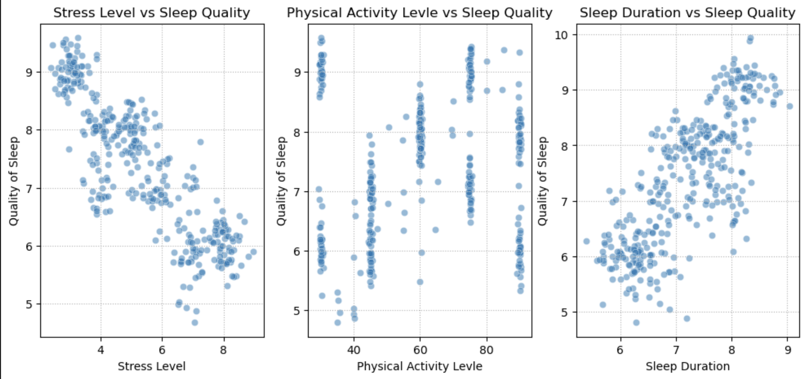

# capstone_project_sleep_quality

### This project was conducted to support organizational decision-making and employee well-being initiatives, rather than focusing on individual-level outcomes.

## Project Context
This project was conducted as part of an internal HR analytics initiative at Star Health Systems, a mid-sized organization focused on employee well-being and workforce sustainability.

The objective was not to evaluate individual employees, but to identify occupational that are systematically exposed to poor sleep quality and elevated stress levels, and to provide data-driven recommendations that can support organization-wide wellness strategies.

## Business Objective
- Identify occupational cohorts at higher risk of poor sleep quality
- Quantify the impact of lifestyle and stress-related factors on sleep outcomes
- Provide actionable, organization-level recommendations to improve employee well-being

## Question 1

| Category             | Details                                                                                                                                  |
| -------------------- | ---------------------------------------------------------------------------------------------------------------------------------------- |
| **Question 1**       | Which occupations have the highest and lowest average sleep quality?                                                                     |
| **Statistical Test** | One-way Analysis of Variance (ANOVA)                                                                                                     |
| **Key Metrics**      | F = **41.65**, p < **0.001**                                                                                                             |
| **Result**           | **Nurses** exhibit the lowest sleep quality, while **engineers** show the highest sleep quality among all occupational                   |
| **Interpretation**   | - High-stress, shift-based roles such as nursing are associated with poorer sleep outcomes  - Roles with more stable schedules and lower physical or emotional strain, such as engineering, demonstrate better sleep quality  - These findings indicate that sleep-related interventions should be prioritized by occupation, rather than applied uniformly across the organization |
## Question 2

| Category             | Details                                                                           |
| -------------------- | --------------------------------------------------------------------------------- |
| **Question 2**       | Which lifestyle factor has the strongest influence on sleep quality?              |
| **Statistical Test** | Pearson Correlation                                                               |
| **Key Metrics**      | Stress r = **-0.91**, Sleep Duration r = **0.88**, Physical Activity r = **0.15** |
| **Result**           | Stress shows the strongest absolute correlation                                   
| **Interpretation**   | - Longer sleep duration generally corresponds to better sleep quality, reinforcing the importance of adequate rest  - Physical activity shows a minimal impact compared to stress and sleep duration, suggesting targeted wellness programs should prioritize stress management and sleep hygiene over general activity interventions  - These insights support occupation-specific wellness initiatives to improve overall employee well-being |

## Question 3

| Category             | Details                                                                    |
| -------------------- | -------------------------------------------------------------------------- |
| **Question 3**       | Which employee are predicted to be at risk of poor sleep quality?          |
| **Statistical Test** | Multiple Linear Regression                                                 |
| **Key Metrics**      | R² = **0.886**, MSE = **0.147**                                            |
| **Result**           | Model demonstrates high predictive performance                             |
| **Interpretation**   | - Stress, sleep duration, and physical activity together explain a large portion of the variance in sleep quality (~88.6%), confirming that employee lifestyle factors are strong predictors of sleep outcomes  - Among these, stress level is the most influential factor, with higher stress strongly reducing predicted sleep quality  - Overall, this predictive modeling approach demonstrates how quantitative analysis can be translated into actionable HR strategies, moving beyond descriptive statistics toward data-driven workforce well-being management|

## ⭐ Actionable Insights
- The analysis delivers actionable insights to support employee well-being, including stress management initiatives, sleep health education, and targeted wellness interventions for high-stress occupations identified in the data.

## Recommended Actions
1. Implement Targeted Stress Management Programs
   - Focus on high-risk occupations identified in the data (nurses, salespeople).
   - Offer scalable programs such as mindfulness sessions, yoga classes, and access to counseling.
   - Expected Impact: Reduce median stress levels by ~15–20%, potentially increasing sleep quality by 1–2 points.
2. Sleep Education & Health Campaigns
   - Launch initiatives to promote adequate sleep and healthy routines, especially for employees with shorter sleep duration (<6.5 hours).
   - Include practical tips, workshops, and digital reminders for better sleep hygiene.
   - Expected Outcomes: Improve employee productivity, reduce fatigue-related errors, and enhance mental health metrics.
3. Monitor Lifestyle Metrics & Evaluate Program Effectiveness
   - Use the predictive model to continuously track high-risk.
   - Measure program impact on stress, sleep quality, and productivity every quarter.
   - Reality Check: Programs should start with 1–2 high-stress departments before scaling company-wide, ensuring feasibility and resource optimization.
4. Integrate HR Analytics into Organizational Planning
   - Embed sleep quality and stress monitoring into HR dashboards for continuous insight.
   - Use data to inform staffing schedules, workload distribution, and wellness budget allocation.

## Conclusion
- Sleep quality differs significantly across occupations; nurses and sales roles are most affected.
- Stress is the primary negative driver, and targeted interventions can meaningfully improve employee sleep.
- Predictive modeling identifies employees at risk with ~88% accuracy, allowing proactive measures.
- Actionable insights support occupation-specific wellness programs, stress management initiatives, and HR strategy planning.
- Implementing these recommendations can lead to measurable improvements in employee well-being, productivity, and organizational efficiency.

